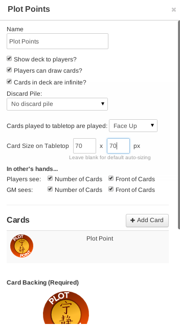
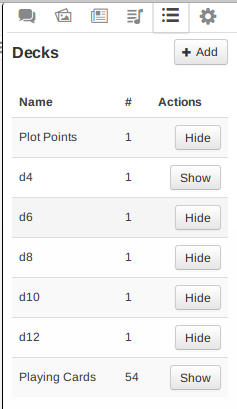
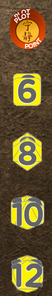
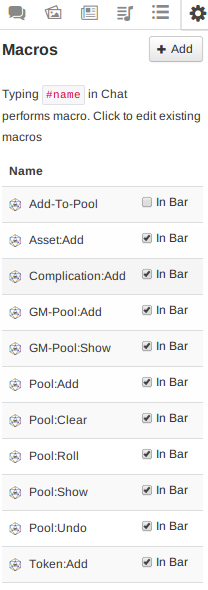

<div class="panel panel-warning">
<div class="panel-heading">Work in Progress</div>
<div class="panel-body">
This document is a work in progress. Please report any bugs, typos,
missing content, or unclear passages to Casey.
</div>
</div>

## Introduction

**Welcome!** You have in your virtual hands here a digital pack of graphics and
scripts for improving the Firefly RPG experience on Roll 20.

To get started, you’ll find setup and usage instructions below.

A Humble Request

:   This pack was lovingly crafted over over many, many hours, and I ask you kindly
    not to redistribute, upload, or share it without permission. Please direct
    people to the [official homepage][projhome] for the project.

### Recent Changes

**v1.0** 22 June 2014

* First version w/ dice roller

### Requirements

* *(GM-only)* Roll 20 Mentor account
* *(GM and Players)* Modern Web browser: latest Chrome, latest Firefox, or Internet Explorer 10

### Features

* Interactive character sheet
* Point 'n click dice pool building and rolling
* Complication and Assets management

## Initial Setup

Setting your Roll 20 campaign with the Firefly RPG Engine is a X step process. It
will take about an hour and requires basic understanding of Roll 20’s user
interface.

### Step 0: Subscribe & Create the campaign

You must have a Mentor level account to use the script. If you don’t it simply
won’t work. Next, create a fresh campaign in Roll 20.

### Step 1: Upload Graphics

Included in the Firefly RPG Roll 20 Engine is a collection of original graphical
assets designed to mimic the feel of tabletop playing and the aesthetic of the
Firefly core rulebook.

The pack includes:

* d4 - d12 dice images (like the kind used in the Firefly corebook)
* Plot point tokens
* Post-it notes
* Index cards
* Tabletop background images

The *minimum* required assets for the Firefly script are the dice and plot point images.

#### Minimum Graphics Upload

* Upload the 70px yellow and green dice images (in `Firefly Graphics Pack/Dice/70px`)
  * I suggest tagging them with `firefly` and `dX` (where x = 2, 6, 8, 10, or 12).
* Upload the 100px Plot point token  (in `Firefly Graphics Pack/Plot Points`)


#### Recommended Graphics Upload

Upload the 70px dice images, 100px plot point tokens, notes, index cards, and
background images.

#### After Uploading

After uploading the images you must find the URLs for the dice images (d4-d12).
To do this open your art library, find the dice images, right click on the
image and select *Copy image URL* or *Copy image location*.

Paste the image url somewhere safe, you will need it in a later step.

Do this for each dice image.

### Step 2: Create Dice Decks

Required reading: [Roll 20 Deck Documentation](https://wiki.roll20.net/Card_Decks_and_Rollable_Tables) for de

During a game of Firefly RPG, the GM and players will need tokens to represent
Big Damn Hero Dice and Plot Points. We use the Roll 20 ‘Decks’ feature to hold
and organize these tokens.

Each deck contains an unlimited number of one card. Players can draw these into
their ‘hand’, or the GM can hand them out by dragging and dropping. Everyone
can see the number of BDH dice and Plot Points each player has.

Create a deck containing 1 card for each of the following tokens:

* Plot point
* d4 - d12

Here is an example for plot points:

\

Each deck should use the following options:

* **Name:** *Plot points, d4, d6, etc*
* (x) **Show deck to players**
* (x) **Players can draw cards?**
* (x) **Cards in deck are infinite?**
* **Discard Pile**: No discard pile
* **Cards played to tabletop are played**: Face Up
* **Card size on table top**: 70 px x 70 px
* **Players See**: (x) Number of Cards, (x) Front of Cards
* **GM Sees**: (x) Number of Cards, (x) Front of Cards

Add one card with the appropriate image. And set the backing to the same image. When you’re finished you should have a list like this:

\

When you have all the decks shown, the side of your Roll 20 table will look
like the image below. You can use the mouse to drag and drop the dice off from
the decks, as well as deal and recall (take back) ‘cards’ from players.

\


### Step 3: Set Character Sheet

From your campaign’s main page, click **Campaign Settings**.

Then, under the **Character Sheet Template**
section, choose the Firefly option.

### Step 4: Upload Firefly Script

From your campaign’s main page, click **API Scripts**.

Add a new script named “*Firefly*” and copy/paste the contents of the
`cortex-engine.js` file included in the engine zip file.

At the top of the pasted file you will find a section called *Cortex Plus
Constants*, and you will see some code that says:

`/* Edit these URLs to point to your dice assets */`

below which you will see some lines such as:
```javascript
    tokenD4: "https://s3.amazonaws.com/files.d20.io/images/3908534/h8snbjLuxlVqawSzCsKs5A/thumb.png?1398993124",
    tokenD6: "https://s3.amazonaws.com/files.d20.io/images/3907733/MDN2yejuiQS52A-8NECVkg/thumb.png?1398988459",
    tokenD8: "https://s3.amazonaws.com/files.d20.io/images/3908533/K3qv6LrN-3Cs3kU1zFIHOg/thumb.png?1398993124",
    tokenD10: "https://s3.amazonaws.com/files.d20.io/images/3908531/ptUfuaVxrtPno1K8RG3X-A/thumb.png?1398993123",
    tokenD12: "https://s3.amazonaws.com/files.d20.io/images/3908532/SCvdCztxZaHmQxLzLotgag/thumb.png?1398993123",
```

Replace the urls in this section with the URLs you saved in step 1.

**At this point:** Launch your campaign, or if you already have it open, close it and relaunch it.

### Step 6: Setup Script

Setting up the script is a two parts.

#### 6a: Create your GM-LIST handout

The GM-LIST handout is a handout we use to identify GM players. Any player that
has access to the GM-LIST handout has access to special GM commands.

Create a handout in your campaign called ‘GM-LIST’, and add yourself, and any
co-GMs, to the “Can be Edited by” list.

#### 6b: Perform script setup

In the chat window type: `!cortex setup`

This will perform initialization routines and create the macros needed to
manipulate dice pools.

**At this point** if everything has gone according to plan you should see the
following macros in your list.

\

You **and all your players** should check the “In Bar” option so they appear
under the player names on the table.

### Step 7: You’re Done!

Setup is now complete. I suggest playing with the dice pool buttons to get an
idea of how to use the system so you can explain it to your players.

## Usage Instructions

TODO: write this section

### Firefly Character Sheet

Using the Firefly character sheet is fairly straightforward. Each player, or
the GM, can fill in the necessary values.

Editing attributes, skills, distinctions, etc is straightforward, simply fill
out the text fields and hover the mouse over the dice image to change its value.

All attributes, skills, specialities, distinctions, and signature assets have roll buttons to add the
corresponding value to the dice pool.

In the case of attributes and skills, click *the name of the attribute or skill
itself* to add the dice to the pool.

For specialities, distinctions, and signature assets, click the little dice
icon to add the appropriate dice value to the pool.

* Dice Macros
  * Dice pool buttons for: adding, clearing, rolling, undo, show
* Character Sheet
  * Fill in all data
  * Mouse over yellow dice images to change their value
  * Click the NAMES of skills and attributes affect to add the corresponding value to the pool
  * Click the small dice icon to add skill specialities and distinctions to the pool

TODO: make screenshots and video showing how to use the character sheet

### Recommended Roll 20 Settings

#### In Game Settings

If not using video in Roll 20, it is recommended to set the **Video/Player
Avatar Size** option to “Names Only” under the *Video+Voice* section in the
settings tab.

(x) **Show Macro quick bar?**

[projhome]: https://ramblurr.github.io/roll20-character-sheets/
